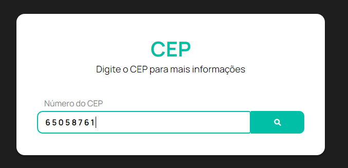
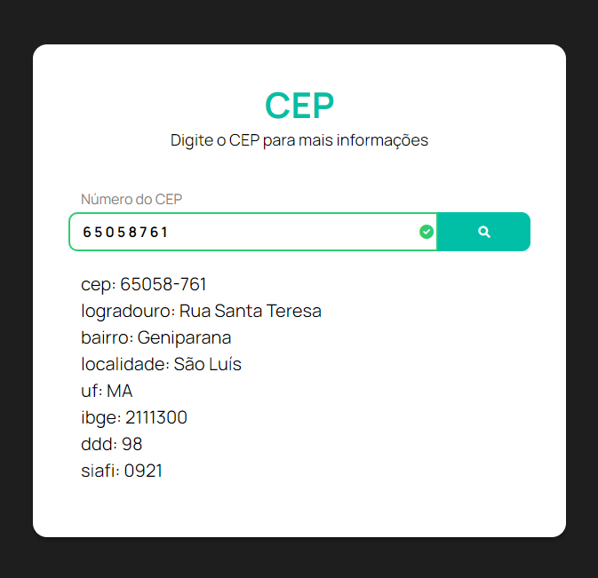

<h1 align="center">CEP SEARCH</h1>

<p align="center">

</p>

#

## 👩‍🔬 [CEP SEARCH](https://pablokaua.github.io/cep-search/)

site recebe um número de **CEP**, valida o valor e consome a **API** [Via Cep](https://viacep.com.br/) para retornar o endereço atrelado ao **CEP**

### Entrada:
<p align="center">

</p>

### Saída:
<p align="center">

</p>

#

## 💻 Tecnologias:
- DOM
- CSS
- HTML
- API

##

## 👥Clone o projeto:

```
git clone https://github.com/pablokaua/cep-search.git
```
